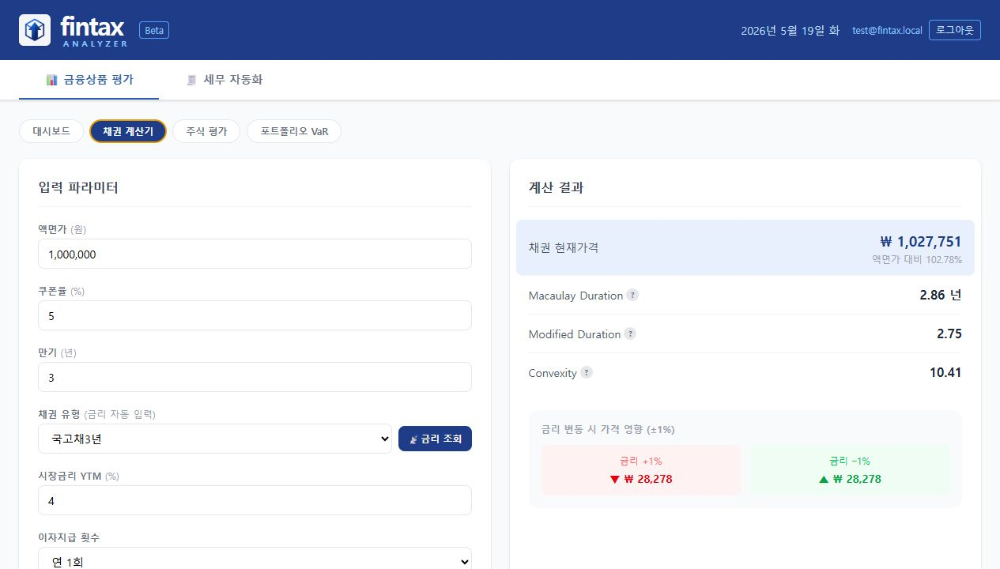
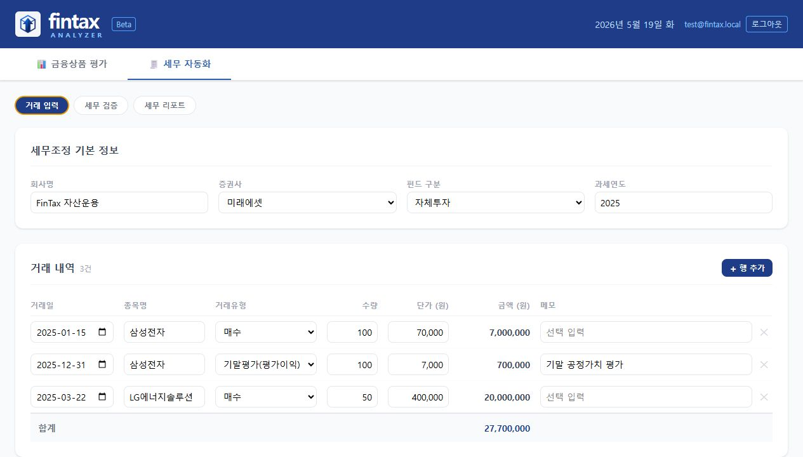
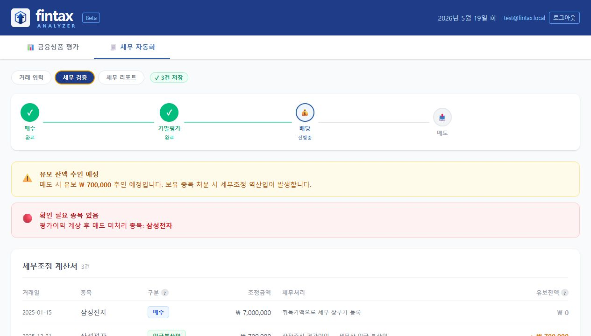
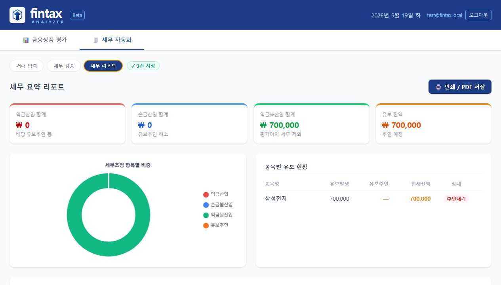

# FinTax Analyzer

금융 자산 가치평가와 법인 세무조정 검증을 하나의 업무 흐름으로 묶은 React 기반 웹 애플리케이션입니다. 채권·주식·포트폴리오 위험 분석과 상장주식 기말평가 세무처리를 탭 기반 UI에서 입력, 계산, 검증, 리포트까지 이어서 확인할 수 있습니다.

> FinTax Analyzer는 프로토타입입니다. 주식 현재가와 일부 시장 데이터는 KIS 모의투자 API를 통해 조회되므로 응답 지연, 일시적 실패, 실제 거래 시세와의 차이가 발생할 수 있습니다. 계산 결과는 기능 검증과 포트폴리오 참고용으로만 사용해 주세요.

---

## 프로젝트 요약

| 항목 | 내용 |
|---|---|
| 목적 | 금융상품 평가와 세무조정 검토를 수작업 엑셀 흐름에서 웹 기반 계산·검증 흐름으로 전환 |
| 대상 사용자 | 법인 보유 금융자산을 관리하는 재무·세무 담당자, 회계/세무 검토자 |
| 핵심 가치 | 입력 데이터 기반 즉시 계산, 세법 기준 자동 검증, 리포트 시각화, 저장 가능한 업무 흐름 |
| 구현 범위 | 인증, 채권 계산, 주식 가치평가, 포트폴리오 VaR, 거래 입력, 세무 검증, 세무 리포트 |

---

## 스크린샷

### 채권 계산기

액면가, 쿠폰율, 만기, YTM을 입력하면 채권 현재가격, Duration, Convexity와 금리 변동 민감도를 계산합니다.



### 세무 거래 입력

법인 보유 주식의 매수, 기말평가, 배당, 매도 거래를 행 단위로 관리하고 거래 유형별 합계를 즉시 계산합니다.



### 세무 검증

법인세법 §42③ 기준으로 기말평가손익 세무처리, 유보 잔액, 추인 예정 금액, 누락 가능 거래를 자동으로 표시합니다.



### 세무 리포트

세무조정 결과를 요약 카드, 도넛 차트, 종목별 유보 현황으로 정리하고 인쇄/PDF 저장 흐름을 제공합니다.



---

## 주요 기능

### 금융 분석

| 기능 | 구현 내용 |
|---|---|
| 대시보드 | 총 평가자산, 포트폴리오 VaR, 세무 유보 잔액, 최근 계산 이력 요약 |
| 채권 계산기 | 현재가, Macaulay Duration, Modified Duration, Convexity, 금리 변동 시 가격 영향 계산 |
| 주식 가치평가 | PER법(IV_A)과 DDM(IV_B) 기반 내재가치 산출, 현재가 대비 업사이드와 투자 판정 표시 |
| 포트폴리오 VaR | 보유 종목 구성 관리, KIS 일봉 수익률 기반 95%/99% VaR 산출, 분포 히스토그램 표시 |

### 세무 자동화

| 기능 | 구현 내용 |
|---|---|
| 거래 입력 | 매수·매도·기말평가·배당 거래 입력, 유형별 합계, 저장 흐름 |
| 세무 검증 | 상장주식 기말평가 익금불산입/손금불산입, 유보 추적, 미처리 거래 경고 |
| 세무 리포트 | 세목별 요약, 세무조정 항목별 차트, 종목별 유보 현황, 인쇄/PDF 저장 지원 |

---

## 기술 포인트

- **React 19 + Vite 8** 기반의 탭형 SPA 구조
- **TailwindCSS v4** CSS-first 설정으로 일관된 업무용 UI 구성
- **Chart.js / react-chartjs-2** 기반 채권 민감도, VaR 분포, 세무조정 차트 시각화
- **Supabase Auth** 기반 로그인과 개발용 테스트 회원 흐름 분리
- **Vercel Functions** 기반 `/api/market/*` 프록시로 KIS/BOK 등 외부 데이터 조회 분리
- 세무 계산 로직은 `src/utils/taxCalc.js`에 집중시켜 UI와 계산 책임을 분리

---

## 프로젝트 구조

```text
src/
├── components/
│   ├── Dashboard.jsx          # 요약 카드 + 빠른 실행
│   ├── BondCalculator.jsx     # 채권 계산기
│   ├── StockValuation.jsx     # 주식 가치평가
│   ├── PortfolioRisk.jsx      # 포트폴리오 위험 분석
│   ├── TaxEntry.jsx           # 거래 내역 입력
│   ├── TaxValidator.jsx       # 세무 검증
│   ├── TaxReport.jsx          # 세무 보고서
│   ├── Auth/                  # 로그인/인증 가드
│   └── ui/                    # 재사용 UI 컴포넌트
├── hooks/
│   └── useDebounce.js
├── lib/
│   ├── supabase.js
│   └── testUser.js
├── utils/
│   └── taxCalc.js             # 세무 계산 순수 함수
└── App.jsx                    # 탭 라우팅 및 전역 상태

api/
└── market/                    # 주식/채권/검색/히스토리 API 프록시
```

---

## 시작하기

```bash
# 의존성 설치
npm install

# 프론트엔드만 실행
npm run dev

# App + API 함께 실행 (권장)
npm run dev:full

# API 함수만 실행
npm run dev:api

# 프로덕션 빌드
npm run build

# 린트
npm run lint
```

`npm run dev`만 실행하면 Vite 프론트엔드만 뜨고 `/api/*` 함수는 동작하지 않습니다. 시장 데이터 조회까지 확인하려면 `npm run dev:full`을 사용하세요.

---

## 환경 변수

`.env.local`에 다음 값을 설정합니다.

```text
VITE_SUPABASE_URL=
VITE_SUPABASE_ANON_KEY=
KIS_APP_KEY=
KIS_APP_SECRET=
BOK_API_KEY=
```

개발 환경에서는 테스트 회원 버튼으로 인증 흐름을 빠르게 통과할 수 있습니다.

---

## 검증

```bash
npm run lint
npm run build
```

현재 별도 테스트 프레임워크는 설정되어 있지 않아, 린트와 프로덕션 빌드를 기본 검증 명령으로 사용합니다.

---

## 한계와 개선 방향

- KIS 모의투자 API 특성상 시세 응답이 지연되거나 실제 거래 시세와 다를 수 있습니다.
- 세무 로직은 프로토타입 기준이며, 실제 신고 전 세무 전문가 검토가 필요합니다.
- 향후 개선 여지는 테스트 코드 추가, 리포트 PDF 서식 고도화, 포트폴리오 샘플 데이터/백테스트 확장입니다.
